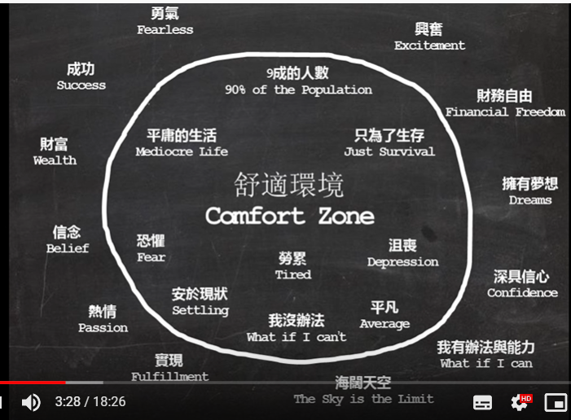

# Ted Talks

- [Ted Talks](#ted-talks)
  - [自行的技巧 - 伊万·约瑟夫博士（2012.01.14）](#%e8%87%aa%e8%a1%8c%e7%9a%84%e6%8a%80%e5%b7%a7---%e4%bc%8a%e4%b8%87%e7%ba%a6%e7%91%9f%e5%a4%ab%e5%8d%9a%e5%a3%ab20120114)
  - [知道自己该待在哪个圈子 - Konwing which cadre to stay(2016.09.03)](#%e7%9f%a5%e9%81%93%e8%87%aa%e5%b7%b1%e8%af%a5%e5%be%85%e5%9c%a8%e5%93%aa%e4%b8%aa%e5%9c%88%e5%ad%90---konwing-which-cadre-to-stay20160903)
  - [What makes you special? (2017.02.03)](#what-makes-you-special-20170203)
  - [How to know your life purpose in 5 minutes (2013.02.02)](#how-to-know-your-life-purpose-in-5-minutes-20130202)

## 自行的技巧 - 伊万·约瑟夫博士（2012.01.14）

> 没有自信这个技巧你注定没法成功

> 没有魔法按钮，通过反复的练习

> 和自己对话，思想影响行动，当别人已经给了你太多的否定了，你不需要在告诉你自己不行，告诉自己你可以，远离那些打击你自信心的人

> 抓住别人的出色之处，学会夸奖

> **自信的人用自己的方式来理解别人的反馈**

## 知道自己该待在哪个圈子 - Konwing which cadre to stay(2016.09.03)

伪舒适圈

> 

有时候留在真正的舒适圈是有可能有好事发生的

> 一个想要离开公司财务职位准备自己经营烧烤店的人，贷款 200w 买了一个商铺，开始专研经商之道，中途放弃，2 年之后卖出商铺赚了 200w

转换身份之后不要给自己太大的压力

在过度的舒适和过度的压力的时候都是会让自己的身心和发展受限

> 

**没有人有权利让你走出你的 comfortable zone，但每个人都有义务去找到自己的 magic zone。**

## What makes you special? (2017.02.03)

when you are different you have to work at belonging
当你身处新环境，你需要花时间找到自己的归属感

when we label someone as different, it dehumanizes them in a way.

The first step in being more inclusive is recognizing our blind spots.

Being different is an advantage.

There are difference that really suck...dont't let them define you!

The single thing ervery one of us has in common is being human.So take a stand to defend your race, the human race.

## How to know your life purpose in 5 minutes (2013.02.02)

Happier people make it a point to make other people happy,and do things make them feel well taken care of and secure.
那些更快乐的人专注让别人快乐,并让他们感觉被照顾和安全。

我点开了这个视频我以为我不会有什么收获，果真如此。
